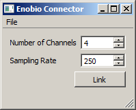

== Warning ==

This application is untested and uses and older SDK that is no longer supported by the manufacturer.
The manufacturer now provides native LSL support directly in their [NIC2 software](https://www.neuroelectrics.com/solution/software-integrations/nic2). Please use the native support instead of this repository.

== Usage ==

The program is currently untested by should work with the current-generation Enobio dry/wireless EEG systems produced by Neuroelectrics (http://www.neuroelectrics.com/) / Starlab (http://starlab.es/).

  * Make sure that the device is turned on an properly connected.

  * Start the Enobio app. You should see a window like the following.
>

  * It is critical that you set the correct channel number for your device and sampling rate (they are not auto-deduced).

  * Click the "Link" button. If all goes well you should now have a stream on your lab network that has name "Enobio" and type "EEG". Note that you cannot close the app while you are linked.

  * The filter setting can be saved in the config file for subsequent use via File / Save Configuration. It is also possible to make a desktop shortcut that appends to the shortcut's Target field the snippet `-c name_of_config.cfg`.
